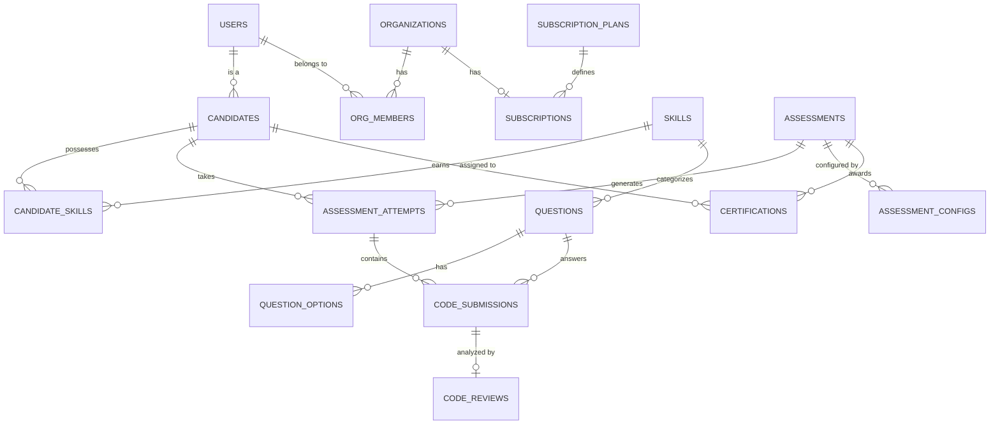

# Database Entity Relationship Diagram (ERD)

## Key Entities
* `users`: Base table synced with Supabase Auth.
* `organizations`: Company profiles.
* `candidates`: Extended user profile for job seekers.
* `skills` & `candidate_skills`: Many-to-many relationship for talent tracking.
* `assessments`: Exam templates.
* `assessment_attempts`: Instances of a candidate taking an exam.
* `code_submissions`: Individual coding answers within an attempt.
* `code_reviews`: AI-generated feedback attached to code submissions.
